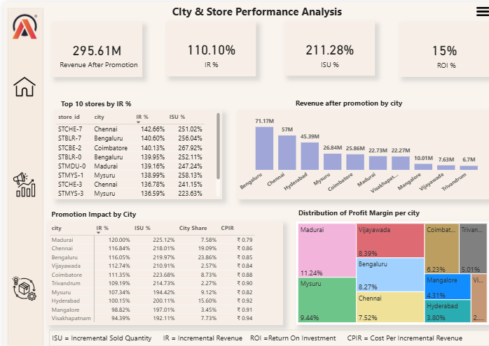
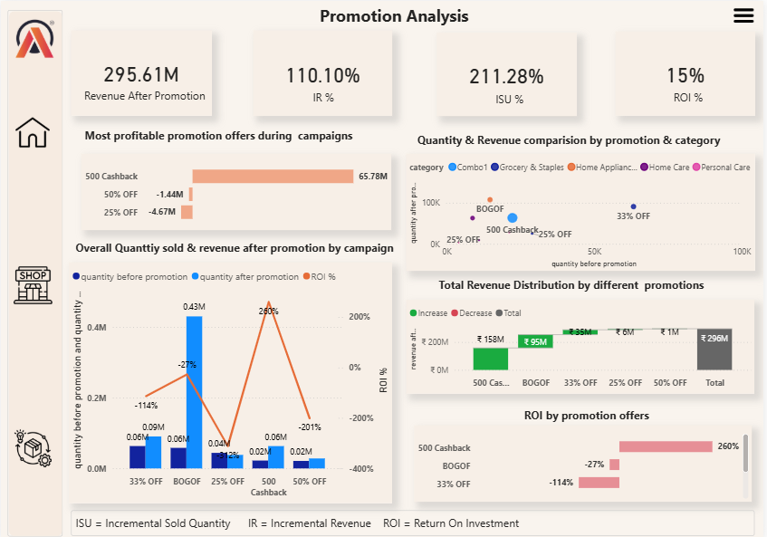
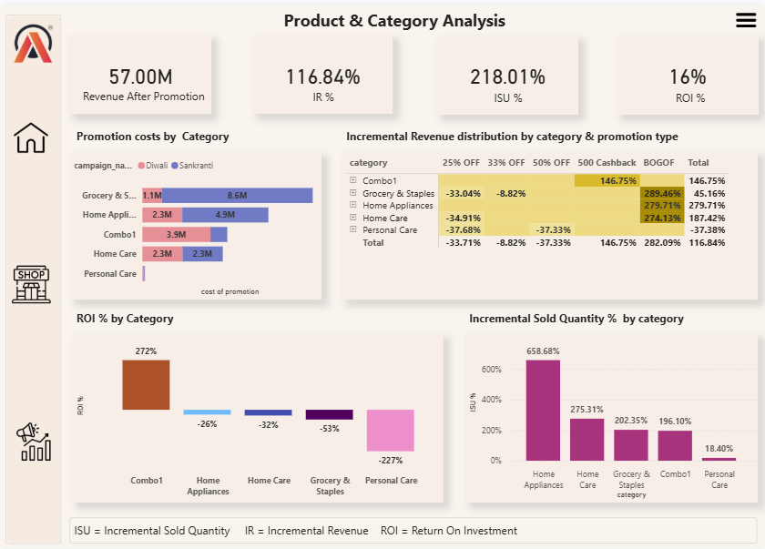

# 📊 AtliQ Mart Promotional Campaign Analysis

An end-to-end Business Intelligence project analyzing the effectiveness of promotional campaigns conducted by AtliQ Mart during the **Diwali 2023** and **Sankranti 2024** festive seasons.

The project combines **SQL**, **Power BI**, and **business analytics** to evaluate promotional performance, identify high-performing campaigns, and provide data-driven recommendations for future marketing strategies.

---

# 📌 Problem Statement

AtliQ Mart is a leading FMCG retail chain operating over **50 supermarkets across Southern India**.

During the festive seasons of **Diwali 2023** and **Sankranti 2024**, AtliQ launched multiple promotional offers on its branded products.

The Sales Director wanted to answer key business questions:

- Which promotions generated the highest revenue?
- Which promotions increased sales volume but reduced profitability?
- Which cities and stores performed the best?
- Which product categories benefited the most?
- Which promotions should be continued in future campaigns?

The objective was to build an interactive analytical dashboard and generate actionable business insights for future promotional planning.

---

# 🎯 Project Objectives

- Analyze promotional campaign performance
- Compare revenue before and after promotions
- Measure Incremental Revenue (IR%)
- Measure Incremental Sold Units (ISU%)
- Calculate Return on Investment (ROI%)
- Analyze profitability of different promotional offers
- Identify top-performing cities, stores, products, and categories
- Answer stakeholder ad-hoc business requests using SQL
- Recommend future promotional strategies

---

# 🛠️ Tech Stack

- SQL (MySQL)
- Power BI
- DAX
- Power Query
- Data Modeling
- Data Visualization
- Business Analytics

---

# 📂 Dataset

The project consists of four tables:

### Fact Table

- fact_events

Contains promotional sales transactions including:

- Product
- Store
- Campaign
- Base Price
- Promotion Type
- Quantity Sold Before Promotion
- Quantity Sold After Promotion

### Dimension Tables

- dim_products
- dim_stores
- dim_campaigns

These tables provide information about products, stores, and promotional campaigns.

---

# 📐 KPIs Used

The dashboard tracks the following business KPIs:

- Revenue After Promotion
- Incremental Revenue (IR)
- Incremental Revenue %
- Incremental Sold Units %
- ROI %
- Profit Margin
- Cost per Incremental Revenue (CPIR)
- City Share %

---

# 📈 Dashboard Features

## 1️⃣ City & Store Performance

- Revenue by city
- Top-performing stores
- ROI by city
- Profit margin analysis
- City contribution analysis

---

## 2️⃣ Promotion Analysis

- Promotion-wise revenue
- Promotion-wise sales volume
- Campaign comparison
- Revenue distribution
- Quantity comparison

---

## 3️⃣ Product & Category Analysis

- Category performance
- Product performance
- Incremental Revenue %
- Incremental Sold Quantity %
- ROI by category

---
---

# 📸 Dashboard Preview

## 1. City & Store Performance Dashboard



---

## 2. Promotion Analysis Dashboard



---

## 3. Product & Category Analysis Dashboard



---

# 💻 SQL Business Requests Solved

The project also includes SQL solutions for stakeholder ad-hoc requests.

Examples include:

- Products priced above ₹500 under BOGOF
- Store count by city
- Campaign-wise revenue comparison
- ISU% by category
- Top 5 products by Incremental Revenue %

The SQL queries make extensive use of:

- CTEs
- Joins
- Aggregate Functions
- Window Functions (DENSE_RANK)
- Business Calculations

---

# 📊 Key Business Insights

### Revenue

- Total Revenue After Promotion reached **₹295.61 Million**

### Best Revenue Generating Cities

- Bengaluru
- Chennai
- Hyderabad

### Best Promotion

✅ ₹500 Cashback

- Highest ROI
- Highest profitability
- Strong customer adoption

### Promotions to Reconsider

- 25% OFF
- 50% OFF

These promotions generated poor ROI and lower incremental revenue.

### Category Insights

High-performing categories:

- Home Appliances
- Home Care
- Grocery & Staples

Low-performing category:

- Personal Care

---

# 💡 Business Recommendations

- Continue cashback-based promotional campaigns.
- Revisit pricing strategy for BOGOF promotions to improve profitability.
- Reduce dependence on flat percentage discounts.
- Focus marketing efforts on Bengaluru and Chennai.
- Redesign promotional strategy for Personal Care products.
- Use customer segmentation for future personalized campaigns.

---

# 📁 Repository Structure

```
Atliq_Promotional_Analysis/
│
├── SQL/
│   └── Atliq_promotion_analysis.sql
│
├── Dashboard/
│   └── Atliq_promotional_analysis_dashboard.pbix
│
├── Presentation/
│   └── AtliQ Promotions & its Impact Analysis.pdf
│
├── README.md
```


# 🚀 Future Improvements

- Customer Segmentation using RFM Analysis
- Time Series Forecasting
- Promotion Recommendation Engine
- Automated Power BI Refresh
- Customer Lifetime Value Analysis

---

# 👨‍💻 Author

**Divya Mashruwala**


---
